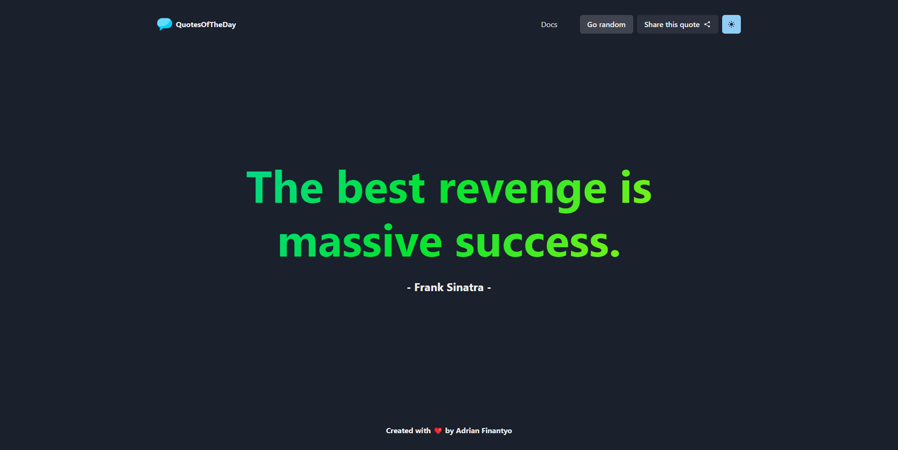

# 📖KC (Knowledge Center)

KC stands for Knowledge Center is my knowledge base that is a a collection of my personal notes and references that I use for my daily work. I have been using this for a while and I think it's time to share it with the community. I hope this can be useful others that have same interest. Most of it may be opinionated and not work for everyone, but feel free to explore and use the content here as your reference if you find it useful.

## 📚Table of Contents

- [Docs](/docs)
- [Notes](/notes)

## 📝License

This project is licensed under the MIT License - see the [LICENSE](/LICENSE.md) file for details

## 🙏Acknowledgments

- Inspired by [sozonome/my-base](https://github.com/sozonome/my-base)
- [Knowledge icons created by pojok d - Flaticon](https://www.flaticon.com/free-icons/knowledge)
